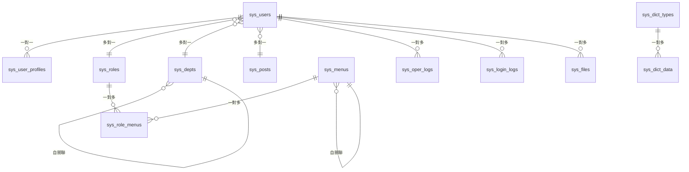

# 資料庫設計文檔

本文件詳細說明 Go-Admin 系統的資料庫設計，包含資料表結構、關聯關係、索引策略等內容。

## 概要

Go-Admin 採用關聯式資料庫設計，基於 RBAC (Role-Based Access Control) 模型實現權限管理，支援 MySQL、PostgreSQL 和 SQLite 等多種資料庫。

## 資料庫架構

### 技術架構

```
Application Layer (應用層)
    ↓
GORM (ORM 層)
    ↓
Database Driver (驅動層)
    ↓
Database Server (資料庫伺服器)
```

### 支援的資料庫

| 資料庫         | 版本支援 | 適用場景 | 特色               |
| -------------- | -------- | -------- | ------------------ |
| **MySQL**      | 5.7+     | 生產環境 | 穩定性高，效能優秀 |
| **PostgreSQL** | 12+      | 企業應用 | 功能豐富，SQL 標準 |
| **SQLite**     | 3.x      | 開發測試 | 輕量級，免安裝     |

## 核心資料表設計

### 1. 使用者管理模組

#### 系統使用者表 (sys_users)

```sql
CREATE TABLE `sys_users` (
  `id` int(11) NOT NULL AUTO_INCREMENT COMMENT '使用者ID',
  `username` varchar(64) NOT NULL COMMENT '使用者名稱',
  `password` varchar(128) NOT NULL COMMENT '密碼(加密)',
  `nickname` varchar(128) DEFAULT NULL COMMENT '暱稱',
  `phone` varchar(11) DEFAULT NULL COMMENT '手機號碼',
  `role_id` int(11) DEFAULT NULL COMMENT '角色ID',
  `avatar` varchar(255) DEFAULT NULL COMMENT '頭像路徑',
  `sex` varchar(255) DEFAULT NULL COMMENT '性別',
  `email` varchar(128) DEFAULT NULL COMMENT '信箱',
  `dept_id` int(11) DEFAULT NULL COMMENT '部門ID',
  `post_id` int(11) DEFAULT NULL COMMENT '職位ID',
  `remark` varchar(255) DEFAULT NULL COMMENT '備註',
  `status` varchar(4) DEFAULT NULL COMMENT '狀態',
  `create_by` int(11) DEFAULT NULL COMMENT '建立人',
  `update_by` int(11) DEFAULT NULL COMMENT '更新人',
  `created_at` datetime DEFAULT NULL COMMENT '建立時間',
  `updated_at` datetime DEFAULT NULL COMMENT '更新時間',
  `deleted_at` datetime DEFAULT NULL COMMENT '刪除時間',
  PRIMARY KEY (`id`),
  UNIQUE KEY `username` (`username`),
  KEY `idx_sys_users_deleted_at` (`deleted_at`),
  KEY `idx_role_id` (`role_id`),
  KEY `idx_dept_id` (`dept_id`),
  KEY `idx_status` (`status`)
) ENGINE=InnoDB DEFAULT CHARSET=utf8mb4 COMMENT='系統使用者表';
```

#### 使用者設定檔表 (sys_user_profiles)

```sql
CREATE TABLE `sys_user_profiles` (
  `id` int(11) NOT NULL AUTO_INCREMENT COMMENT '設定檔ID',
  `user_id` int(11) NOT NULL COMMENT '使用者ID',
  `theme` varchar(32) DEFAULT 'default' COMMENT '主題設定',
  `language` varchar(16) DEFAULT 'zh-TW' COMMENT '語言設定',
  `timezone` varchar(32) DEFAULT 'Asia/Taipei' COMMENT '時區設定',
  `notification_settings` json COMMENT '通知設定',
  `preferences` json COMMENT '偏好設定',
  `created_at` datetime DEFAULT NULL COMMENT '建立時間',
  `updated_at` datetime DEFAULT NULL COMMENT '更新時間',
  PRIMARY KEY (`id`),
  UNIQUE KEY `user_id` (`user_id`),
  CONSTRAINT `fk_user_profiles_user_id` FOREIGN KEY (`user_id`) REFERENCES `sys_users` (`id`) ON DELETE CASCADE
) ENGINE=InnoDB DEFAULT CHARSET=utf8mb4 COMMENT='使用者設定檔表';
```

### 2. 角色權限模組

#### 系統角色表 (sys_roles)

```sql
CREATE TABLE `sys_roles` (
  `id` int(11) NOT NULL AUTO_INCREMENT COMMENT '角色ID',
  `role_name` varchar(128) NOT NULL COMMENT '角色名稱',
  `status` varchar(4) DEFAULT NULL COMMENT '狀態',
  `role_key` varchar(128) DEFAULT NULL COMMENT '角色標識',
  `role_sort` int(4) DEFAULT NULL COMMENT '角色排序',
  `flag` varchar(128) DEFAULT NULL COMMENT '標記',
  `remark` varchar(255) DEFAULT NULL COMMENT '備註',
  `admin` tinyint(1) DEFAULT '0' COMMENT '是否管理員',
  `create_by` int(11) DEFAULT NULL COMMENT '建立人',
  `update_by` int(11) DEFAULT NULL COMMENT '更新人',
  `created_at` datetime DEFAULT NULL COMMENT '建立時間',
  `updated_at` datetime DEFAULT NULL COMMENT '更新時間',
  `deleted_at` datetime DEFAULT NULL COMMENT '刪除時間',
  PRIMARY KEY (`id`),
  UNIQUE KEY `role_key` (`role_key`),
  KEY `idx_sys_roles_deleted_at` (`deleted_at`),
  KEY `idx_status` (`status`),
  KEY `idx_role_sort` (`role_sort`)
) ENGINE=InnoDB DEFAULT CHARSET=utf8mb4 COMMENT='系統角色表';
```

#### 角色選單關聯表 (sys_role_menus)

```sql
CREATE TABLE `sys_role_menus` (
  `id` int(11) NOT NULL AUTO_INCREMENT COMMENT '關聯ID',
  `role_id` int(11) NOT NULL COMMENT '角色ID',
  `menu_id` int(11) NOT NULL COMMENT '選單ID',
  `created_at` datetime DEFAULT NULL COMMENT '建立時間',
  PRIMARY KEY (`id`),
  UNIQUE KEY `uk_role_menu` (`role_id`,`menu_id`),
  KEY `idx_role_id` (`role_id`),
  KEY `idx_menu_id` (`menu_id`),
  CONSTRAINT `fk_role_menus_role_id` FOREIGN KEY (`role_id`) REFERENCES `sys_roles` (`id`) ON DELETE CASCADE,
  CONSTRAINT `fk_role_menus_menu_id` FOREIGN KEY (`menu_id`) REFERENCES `sys_menus` (`id`) ON DELETE CASCADE
) ENGINE=InnoDB DEFAULT CHARSET=utf8mb4 COMMENT='角色選單關聯表';
```

### 3. 選單管理模組

#### 系統選單表 (sys_menus)

```sql
CREATE TABLE `sys_menus` (
  `id` int(11) NOT NULL AUTO_INCREMENT COMMENT '選單ID',
  `menu_name` varchar(64) NOT NULL COMMENT '選單名稱',
  `title` varchar(64) DEFAULT NULL COMMENT '選單標題',
  `icon` varchar(128) DEFAULT NULL COMMENT '選單圖示',
  `path` varchar(128) DEFAULT NULL COMMENT '路由路徑',
  `paths` varchar(128) DEFAULT NULL COMMENT '路由層級',
  `menu_type` varchar(1) DEFAULT NULL COMMENT '選單類型(M目錄C選單F按鈕)',
  `action` varchar(16) DEFAULT NULL COMMENT '操作類型',
  `permission` varchar(255) DEFAULT NULL COMMENT '權限標識',
  `parent_id` int(11) DEFAULT '0' COMMENT '父選單ID',
  `no_cache` tinyint(1) DEFAULT '0' COMMENT '是否快取',
  `breadcrumb` varchar(255) DEFAULT NULL COMMENT '麵包屑',
  `component` varchar(255) DEFAULT NULL COMMENT '元件路徑',
  `sort` int(4) DEFAULT '0' COMMENT '排序',
  `visible` varchar(1) DEFAULT '1' COMMENT '是否可見',
  `is_frame` varchar(1) DEFAULT '0' COMMENT '是否外鏈',
  `create_by` int(11) DEFAULT NULL COMMENT '建立人',
  `update_by` int(11) DEFAULT NULL COMMENT '更新人',
  `created_at` datetime DEFAULT NULL COMMENT '建立時間',
  `updated_at` datetime DEFAULT NULL COMMENT '更新時間',
  `deleted_at` datetime DEFAULT NULL COMMENT '刪除時間',
  PRIMARY KEY (`id`),
  KEY `idx_sys_menus_deleted_at` (`deleted_at`),
  KEY `idx_parent_id` (`parent_id`),
  KEY `idx_menu_type` (`menu_type`),
  KEY `idx_sort` (`sort`),
  KEY `idx_visible` (`visible`)
) ENGINE=InnoDB DEFAULT CHARSET=utf8mb4 COMMENT='系統選單表';
```

### 4. 部門組織模組

#### 系統部門表 (sys_depts)

```sql
CREATE TABLE `sys_depts` (
  `id` int(11) NOT NULL AUTO_INCREMENT COMMENT '部門ID',
  `parent_id` int(11) DEFAULT '0' COMMENT '父部門ID',
  `dept_path` varchar(255) DEFAULT NULL COMMENT '部門路徑',
  `dept_name` varchar(128) NOT NULL COMMENT '部門名稱',
  `sort` int(4) DEFAULT '0' COMMENT '排序',
  `leader` varchar(128) DEFAULT NULL COMMENT '負責人',
  `phone` varchar(11) DEFAULT NULL COMMENT '聯絡電話',
  `email` varchar(64) DEFAULT NULL COMMENT '信箱',
  `status` varchar(4) DEFAULT '1' COMMENT '狀態',
  `create_by` int(11) DEFAULT NULL COMMENT '建立人',
  `update_by` int(11) DEFAULT NULL COMMENT '更新人',
  `created_at` datetime DEFAULT NULL COMMENT '建立時間',
  `updated_at` datetime DEFAULT NULL COMMENT '更新時間',
  `deleted_at` datetime DEFAULT NULL COMMENT '刪除時間',
  PRIMARY KEY (`id`),
  KEY `idx_sys_depts_deleted_at` (`deleted_at`),
  KEY `idx_parent_id` (`parent_id`),
  KEY `idx_status` (`status`),
  KEY `idx_sort` (`sort`)
) ENGINE=InnoDB DEFAULT CHARSET=utf8mb4 COMMENT='系統部門表';
```

#### 職位表 (sys_posts)

```sql
CREATE TABLE `sys_posts` (
  `id` int(11) NOT NULL AUTO_INCREMENT COMMENT '職位ID',
  `post_name` varchar(128) NOT NULL COMMENT '職位名稱',
  `post_code` varchar(128) NOT NULL COMMENT '職位編碼',
  `sort` int(4) DEFAULT '0' COMMENT '排序',
  `status` varchar(4) DEFAULT '1' COMMENT '狀態',
  `remark` varchar(255) DEFAULT NULL COMMENT '備註',
  `create_by` int(11) DEFAULT NULL COMMENT '建立人',
  `update_by` int(11) DEFAULT NULL COMMENT '更新人',
  `created_at` datetime DEFAULT NULL COMMENT '建立時間',
  `updated_at` datetime DEFAULT NULL COMMENT '更新時間',
  `deleted_at` datetime DEFAULT NULL COMMENT '刪除時間',
  PRIMARY KEY (`id`),
  UNIQUE KEY `post_code` (`post_code`),
  KEY `idx_sys_posts_deleted_at` (`deleted_at`),
  KEY `idx_status` (`status`),
  KEY `idx_sort` (`sort`)
) ENGINE=InnoDB DEFAULT CHARSET=utf8mb4 COMMENT='系統職位表';
```

### 5. 系統配置模組

#### 系統配置表 (sys_configs)

```sql
CREATE TABLE `sys_configs` (
  `id` int(11) NOT NULL AUTO_INCREMENT COMMENT '配置ID',
  `config_name` varchar(128) NOT NULL COMMENT '配置名稱',
  `config_key` varchar(128) NOT NULL COMMENT '配置鍵',
  `config_value` varchar(255) DEFAULT NULL COMMENT '配置值',
  `config_type` varchar(1) DEFAULT 'N' COMMENT '配置類型',
  `is_frontend` varchar(1) DEFAULT '0' COMMENT '是否前端',
  `remark` varchar(255) DEFAULT NULL COMMENT '備註',
  `create_by` int(11) DEFAULT NULL COMMENT '建立人',
  `update_by` int(11) DEFAULT NULL COMMENT '更新人',
  `created_at` datetime DEFAULT NULL COMMENT '建立時間',
  `updated_at` datetime DEFAULT NULL COMMENT '更新時間',
  PRIMARY KEY (`id`),
  UNIQUE KEY `config_key` (`config_key`),
  KEY `idx_config_type` (`config_type`),
  KEY `idx_is_frontend` (`is_frontend`)
) ENGINE=InnoDB DEFAULT CHARSET=utf8mb4 COMMENT='系統配置表';
```

#### 字典類型表 (sys_dict_types)

```sql
CREATE TABLE `sys_dict_types` (
  `id` int(11) NOT NULL AUTO_INCREMENT COMMENT '字典ID',
  `dict_name` varchar(128) DEFAULT NULL COMMENT '字典名稱',
  `dict_type` varchar(128) DEFAULT NULL COMMENT '字典類型',
  `status` varchar(1) DEFAULT '1' COMMENT '狀態',
  `remark` varchar(255) DEFAULT NULL COMMENT '備註',
  `create_by` int(11) DEFAULT NULL COMMENT '建立人',
  `update_by` int(11) DEFAULT NULL COMMENT '更新人',
  `created_at` datetime DEFAULT NULL COMMENT '建立時間',
  `updated_at` datetime DEFAULT NULL COMMENT '更新時間',
  `deleted_at` datetime DEFAULT NULL COMMENT '刪除時間',
  PRIMARY KEY (`id`),
  UNIQUE KEY `dict_type` (`dict_type`),
  KEY `idx_sys_dict_types_deleted_at` (`deleted_at`),
  KEY `idx_status` (`status`)
) ENGINE=InnoDB DEFAULT CHARSET=utf8mb4 COMMENT='字典類型表';
```

#### 字典資料表 (sys_dict_data)

```sql
CREATE TABLE `sys_dict_data` (
  `id` int(11) NOT NULL AUTO_INCREMENT COMMENT '字典編碼',
  `dict_sort` int(4) DEFAULT '0' COMMENT '字典排序',
  `dict_label` varchar(128) DEFAULT NULL COMMENT '字典標籤',
  `dict_value` varchar(128) DEFAULT NULL COMMENT '字典鍵值',
  `dict_type` varchar(128) DEFAULT NULL COMMENT '字典類型',
  `css_class` varchar(128) DEFAULT NULL COMMENT '樣式屬性',
  `list_class` varchar(128) DEFAULT NULL COMMENT '表格回顯樣式',
  `is_default` varchar(1) DEFAULT 'N' COMMENT '是否預設',
  `status` varchar(1) DEFAULT '1' COMMENT '狀態',
  `default` varchar(8) DEFAULT NULL COMMENT '預設值',
  `remark` varchar(255) DEFAULT NULL COMMENT '備註',
  `create_by` int(11) DEFAULT NULL COMMENT '建立人',
  `update_by` int(11) DEFAULT NULL COMMENT '更新人',
  `created_at` datetime DEFAULT NULL COMMENT '建立時間',
  `updated_at` datetime DEFAULT NULL COMMENT '更新時間',
  `deleted_at` datetime DEFAULT NULL COMMENT '刪除時間',
  PRIMARY KEY (`id`),
  KEY `idx_sys_dict_data_deleted_at` (`deleted_at`),
  KEY `idx_dict_type` (`dict_type`),
  KEY `idx_dict_sort` (`dict_sort`),
  KEY `idx_status` (`status`)
) ENGINE=InnoDB DEFAULT CHARSET=utf8mb4 COMMENT='字典資料表';
```

### 6. 日誌管理模組

#### 操作日誌表 (sys_oper_logs)

```sql
CREATE TABLE `sys_oper_logs` (
  `id` int(11) NOT NULL AUTO_INCREMENT COMMENT '日誌主鍵',
  `title` varchar(255) DEFAULT NULL COMMENT '模組標題',
  `business_type` varchar(128) DEFAULT '0' COMMENT '業務類型',
  `business_types` varchar(128) DEFAULT NULL COMMENT '業務類型陣列',
  `method` varchar(128) DEFAULT NULL COMMENT '方法名稱',
  `request_method` varchar(32) DEFAULT NULL COMMENT '請求方式',
  `operator_type` varchar(128) DEFAULT '0' COMMENT '操作類別',
  `oper_name` varchar(128) DEFAULT NULL COMMENT '操作人員',
  `dept_name` varchar(128) DEFAULT NULL COMMENT '部門名稱',
  `oper_url` varchar(255) DEFAULT NULL COMMENT '請求URL',
  `oper_ip` varchar(128) DEFAULT NULL COMMENT '主機地址',
  `oper_location` varchar(255) DEFAULT NULL COMMENT '操作地點',
  `oper_param` text COMMENT '請求參數',
  `json_result` text COMMENT '返回參數',
  `status` varchar(1) DEFAULT '1' COMMENT '操作狀態',
  `error_msg` text COMMENT '錯誤訊息',
  `oper_time` datetime DEFAULT NULL COMMENT '操作時間',
  `cost_time` int(11) DEFAULT '0' COMMENT '消耗時間',
  `created_at` datetime DEFAULT NULL COMMENT '建立時間',
  `updated_at` datetime DEFAULT NULL COMMENT '更新時間',
  PRIMARY KEY (`id`),
  KEY `idx_oper_time` (`oper_time`),
  KEY `idx_business_type` (`business_type`),
  KEY `idx_status` (`status`),
  KEY `idx_oper_name` (`oper_name`)
) ENGINE=InnoDB DEFAULT CHARSET=utf8mb4 COMMENT='操作日誌記錄';
```

#### 登入日誌表 (sys_login_logs)

```sql
CREATE TABLE `sys_login_logs` (
  `id` int(11) NOT NULL AUTO_INCREMENT COMMENT '存取ID',
  `username` varchar(128) DEFAULT NULL COMMENT '使用者帳號',
  `ipaddr` varchar(128) DEFAULT NULL COMMENT '登入IP地址',
  `login_location` varchar(255) DEFAULT NULL COMMENT '登入地點',
  `browser` varchar(128) DEFAULT NULL COMMENT '瀏覽器類型',
  `os` varchar(128) DEFAULT NULL COMMENT '作業系統',
  `platform` varchar(128) DEFAULT NULL COMMENT '登入平台',
  `login_time` datetime DEFAULT NULL COMMENT '登入時間',
  `status` varchar(1) DEFAULT '1' COMMENT '登入狀態',
  `msg` varchar(255) DEFAULT NULL COMMENT '提示訊息',
  `created_at` datetime DEFAULT NULL COMMENT '建立時間',
  `updated_at` datetime DEFAULT NULL COMMENT '更新時間',
  PRIMARY KEY (`id`),
  KEY `idx_login_time` (`login_time`),
  KEY `idx_username` (`username`),
  KEY `idx_status` (`status`)
) ENGINE=InnoDB DEFAULT CHARSET=utf8mb4 COMMENT='系統存取記錄';
```

### 7. 檔案管理模組

#### 檔案資訊表 (sys_files)

```sql
CREATE TABLE `sys_files` (
  `id` int(11) NOT NULL AUTO_INCREMENT COMMENT '檔案ID',
  `name` varchar(255) NOT NULL COMMENT '檔案名稱',
  `original_name` varchar(255) DEFAULT NULL COMMENT '原始檔名',
  `path` varchar(255) NOT NULL COMMENT '檔案路徑',
  `url` varchar(255) DEFAULT NULL COMMENT '檔案URL',
  `size` bigint(20) DEFAULT '0' COMMENT '檔案大小',
  `mime_type` varchar(128) DEFAULT NULL COMMENT 'MIME類型',
  `extension` varchar(32) DEFAULT NULL COMMENT '副檔名',
  `md5` varchar(32) DEFAULT NULL COMMENT 'MD5雜湊值',
  `storage_type` varchar(32) DEFAULT 'local' COMMENT '儲存類型',
  `bucket` varchar(128) DEFAULT NULL COMMENT '儲存桶',
  `upload_by` int(11) DEFAULT NULL COMMENT '上傳人',
  `status` varchar(1) DEFAULT '1' COMMENT '狀態',
  `created_at` datetime DEFAULT NULL COMMENT '建立時間',
  `updated_at` datetime DEFAULT NULL COMMENT '更新時間',
  `deleted_at` datetime DEFAULT NULL COMMENT '刪除時間',
  PRIMARY KEY (`id`),
  UNIQUE KEY `md5` (`md5`),
  KEY `idx_sys_files_deleted_at` (`deleted_at`),
  KEY `idx_upload_by` (`upload_by`),
  KEY `idx_storage_type` (`storage_type`),
  KEY `idx_status` (`status`)
) ENGINE=InnoDB DEFAULT CHARSET=utf8mb4 COMMENT='檔案資訊表';
```

## 資料庫關聯關係

### ER 圖



### 關聯說明

1. **使用者 ↔ 角色**：多對一關係，一個使用者對應一個角色
2. **角色 ↔ 選單**：多對多關係，透過 `sys_role_menus` 中介表
3. **使用者 ↔ 部門**：多對一關係，一個使用者屬於一個部門
4. **部門 ↔ 部門**：自關聯，支援多層級部門結構
5. **選單 ↔ 選單**：自關聯，支援多層級選單結構

## 索引策略

### 主要索引

```sql
-- 使用者表索引
CREATE INDEX idx_username ON sys_users(username);
CREATE INDEX idx_role_dept ON sys_users(role_id, dept_id);
CREATE INDEX idx_status_created ON sys_users(status, created_at);

-- 選單表索引
CREATE INDEX idx_parent_type ON sys_menus(parent_id, menu_type);
CREATE INDEX idx_permission ON sys_menus(permission);

-- 角色選單關聯表索引
CREATE INDEX idx_role_menu_composite ON sys_role_menus(role_id, menu_id);

-- 部門表索引
CREATE INDEX idx_dept_path ON sys_depts(dept_path);
CREATE INDEX idx_parent_status ON sys_depts(parent_id, status);

-- 日誌表索引
CREATE INDEX idx_oper_time_user ON sys_oper_logs(oper_time, oper_name);
CREATE INDEX idx_login_time_status ON sys_login_logs(login_time, status);
```

### 複合索引設計原則

1. **選擇性原則**：高選擇性欄位放在前面
2. **查詢頻率**：常用查詢條件組合建立複合索引
3. **排序最佳化**：ORDER BY 欄位加入索引考慮
4. **覆蓋索引**：小表可考慮覆蓋索引減少回表

## 資料類型選擇

### 常用欄位類型對照

| 用途         | MySQL              | PostgreSQL   | SQLite              | 說明             |
| ------------ | ------------------ | ------------ | ------------------- | ---------------- |
| **主鍵**     | INT AUTO_INCREMENT | SERIAL       | INTEGER PRIMARY KEY | 自增主鍵         |
| **外鍵**     | INT                | INTEGER      | INTEGER             | 關聯欄位         |
| **短字串**   | VARCHAR(64)        | VARCHAR(64)  | TEXT                | 使用者名稱、標題 |
| **長字串**   | VARCHAR(255)       | VARCHAR(255) | TEXT                | 路徑、描述       |
| **大文本**   | TEXT               | TEXT         | TEXT                | 長內容           |
| **JSON**     | JSON               | JSONB        | TEXT                | 結構化資料       |
| **時間戳記** | DATETIME           | TIMESTAMP    | DATETIME            | 時間記錄         |
| **布林值**   | TINYINT(1)         | BOOLEAN      | INTEGER             | 狀態標記         |

### 欄位長度建議

```sql
-- 使用者相關
username: VARCHAR(64)     -- 使用者名稱
password: VARCHAR(128)    -- 加密後密碼
email: VARCHAR(128)       -- 電子信箱
phone: VARCHAR(20)        -- 電話號碼

-- 系統相關
menu_name: VARCHAR(64)    -- 選單名稱
role_name: VARCHAR(128)   -- 角色名稱
dept_name: VARCHAR(128)   -- 部門名稱
permission: VARCHAR(255)  -- 權限字串

-- 檔案相關
file_name: VARCHAR(255)   -- 檔案名稱
file_path: VARCHAR(500)   -- 檔案路徑
mime_type: VARCHAR(128)   -- 檔案類型
```

## 資料庫配置最佳化

### MySQL 配置建議

```ini
# my.cnf
[mysqld]
# 基本配置
character-set-server = utf8mb4
collation-server = utf8mb4_unicode_ci
default-time-zone = '+08:00'

# 連接配置
max_connections = 1000
max_connect_errors = 1000000
wait_timeout = 28800
interactive_timeout = 28800

# 記憶體配置
innodb_buffer_pool_size = 1G
innodb_log_file_size = 256M
key_buffer_size = 256M
query_cache_size = 128M

# 日誌配置
slow_query_log = 1
slow_query_log_file = /var/log/mysql/slow.log
long_query_time = 2

# InnoDB 配置
innodb_file_per_table = 1
innodb_flush_log_at_trx_commit = 2
innodb_flush_method = O_DIRECT
```

### PostgreSQL 配置建議

```ini
# postgresql.conf
# 記憶體配置
shared_buffers = 256MB
work_mem = 8MB
maintenance_work_mem = 128MB

# 連接配置
max_connections = 200
superuser_reserved_connections = 3

# WAL 配置
wal_buffers = 16MB
checkpoint_segments = 32
checkpoint_completion_target = 0.9

# 查詢最佳化
random_page_cost = 1.1
effective_cache_size = 1GB
```

## 資料遷移

### GORM 遷移腳本

```go
// migrations/migrate.go
package migrations

import (
    "gorm.io/gorm"
    "go-admin/common/models"
)

func Migrate(db *gorm.DB) error {
    // 自動遷移核心表
    err := db.AutoMigrate(
        &models.SysUser{},
        &models.SysRole{},
        &models.SysMenu{},
        &models.SysDept{},
        &models.SysPost{},
        &models.SysConfig{},
        &models.SysDictType{},
        &models.SysDictData{},
        &models.SysOperLog{},
        &models.SysLoginLog{},
        &models.SysFile{},
    )

    if err != nil {
        return err
    }

    // 初始化基礎資料
    return InitBaseData(db)
}

func InitBaseData(db *gorm.DB) error {
    // 建立超級管理員角色
    adminRole := &models.SysRole{
        RoleName: "超級管理員",
        RoleKey:  "admin",
        RoleSort: 1,
        Status:   "1",
        Admin:    true,
        Remark:   "超級管理員角色",
    }

    if err := db.FirstOrCreate(adminRole, models.SysRole{RoleKey: "admin"}).Error; err != nil {
        return err
    }

    // 建立預設管理員帳戶
    adminUser := &models.SysUser{
        Username: "admin",
        Password: "$2a$10$hashed_password_here",
        Nickname: "管理員",
        RoleId:   adminRole.Id,
        Status:   "1",
    }

    return db.FirstOrCreate(adminUser, models.SysUser{Username: "admin"}).Error
}
```

### SQL 遷移腳本

```sql
-- 001_create_base_tables.sql
-- 建立基礎表結構
SOURCE create_tables.sql;

-- 002_init_base_data.sql
-- 初始化基礎資料
INSERT INTO sys_roles (role_name, role_key, role_sort, status, admin, remark)
VALUES ('超級管理員', 'admin', 1, '1', 1, '超級管理員角色');

INSERT INTO sys_users (username, password, nickname, role_id, status)
VALUES ('admin', '$2a$10$password_hash', '管理員', 1, '1');

-- 003_create_indexes.sql
-- 建立效能索引
SOURCE create_indexes.sql;
```

## 資料安全

### 敏感資料處理

```go
// 密碼加密
func HashPassword(password string) string {
    hash, _ := bcrypt.GenerateFromPassword([]byte(password), bcrypt.DefaultCost)
    return string(hash)
}

// 手機號脫敏
func MaskPhone(phone string) string {
    if len(phone) != 11 {
        return phone
    }
    return phone[:3] + "****" + phone[7:]
}

// 身分證脫敏
func MaskIDCard(idCard string) string {
    if len(idCard) < 8 {
        return idCard
    }
    return idCard[:4] + "****" + idCard[len(idCard)-4:]
}
```

### 資料備份策略

```bash
#!/bin/bash
# backup.sh - 資料庫備份腳本

DATE=$(date +%Y%m%d_%H%M%S)
BACKUP_DIR="/backup/mysql"
DB_NAME="go_admin"

# MySQL 備份
mysqldump -u root -p${MYSQL_PASSWORD} \
  --single-transaction \
  --routines \
  --triggers \
  ${DB_NAME} > ${BACKUP_DIR}/go_admin_${DATE}.sql

# 壓縮備份檔案
gzip ${BACKUP_DIR}/go_admin_${DATE}.sql

# 清理舊備份 (保留7天)
find ${BACKUP_DIR} -name "*.sql.gz" -mtime +7 -delete
```

## 效能最佳化

### 查詢最佳化建議

1. **使用適當的索引**

   ```sql
   -- 好的查詢
   SELECT * FROM sys_users WHERE username = 'admin' AND status = '1';

   -- 需要索引
   CREATE INDEX idx_username_status ON sys_users(username, status);
   ```

2. **避免 SELECT \***

   ```sql
   -- 避免
   SELECT * FROM sys_users;

   -- 建議
   SELECT id, username, nickname FROM sys_users;
   ```

3. **使用 LIMIT 分頁**

   ```sql
   -- 分頁查詢
   SELECT * FROM sys_oper_logs
   ORDER BY oper_time DESC
   LIMIT 20 OFFSET 0;
   ```

4. **最佳化 JOIN 查詢**
   ```sql
   -- 使用合適的 JOIN 條件
   SELECT u.username, r.role_name, d.dept_name
   FROM sys_users u
   LEFT JOIN sys_roles r ON u.role_id = r.id
   LEFT JOIN sys_depts d ON u.dept_id = d.id
   WHERE u.status = '1';
   ```

### 資料庫監控

```sql
-- 查看慢查詢
SELECT * FROM mysql.slow_log
ORDER BY start_time DESC
LIMIT 10;

-- 檢查表大小
SELECT
    table_name,
    ROUND(((data_length + index_length) / 1024 / 1024), 2) AS "Size (MB)"
FROM information_schema.TABLES
WHERE table_schema = 'go_admin'
ORDER BY (data_length + index_length) DESC;

-- 分析索引使用情況
SHOW INDEX FROM sys_users;
```

## 版本演進

### 資料庫版本管理

```go
// version/version.go
package version

const (
    CurrentVersion = "2.0.0"
    MinVersion     = "1.0.0"
)

var Migrations = map[string]MigrationFunc{
    "1.0.0": Migration_1_0_0,
    "1.1.0": Migration_1_1_0,
    "2.0.0": Migration_2_0_0,
}

type MigrationFunc func(*gorm.DB) error

func Migration_2_0_0(db *gorm.DB) error {
    // 新增使用者設定檔表
    return db.AutoMigrate(&models.SysUserProfile{})
}
```

### 相容性考慮

1. **向後相容**：新版本支援舊資料格式
2. **平滑升級**：提供資料遷移腳本
3. **降級支援**：關鍵更新提供回滾方案

## 相關文件

- [Go-Admin 架構說明](./architecture.md)
- [API 開發指南](./api-guide.md)
- [程式碼生成工具](./code-generation.md)
- [權限系統說明](./permission-system.md)

## 版本記錄

| 版本  | 日期       | 更新內容                     |
| ----- | ---------- | ---------------------------- |
| 1.0.0 | 2025-09-19 | 初始版本，完整資料庫設計文檔 |

---

_最後更新：2025 年 9 月 19 日_
