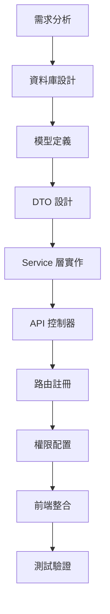

# Go-Admin 模組建立教學

本教學詳細說明如何在 Go-Admin 框架中建立新模組，包含從資料庫設計到前端展示的完整開發流程。

## 模組開發概覽

### 開發流程



### 目錄結構

```
app/admin/
├── models/           # 資料模型
│   └── your_module.go
├── service/         # 業務邏輯層
│   ├── your_module.go
│   └── dto/         # 資料傳輸物件
│       └── your_module.go
├── apis/            # API 控制器
│   └── your_module.go
└── router/          # 路由定義
    └── your_module.go
```

## 實戰範例：建立商品評論模組

我們以「商品評論系統」為例，示範完整的模組建立過程。

### 第一步：需求分析

**功能需求：**

- 使用者可以對商品發表評論
- 支援評分功能（1-5 星）
- 管理員可以審核評論
- 支援評論回覆
- 顯示評論統計

**資料需求：**

- 評論內容、評分、狀態
- 關聯使用者和商品
- 建立時間、更新時間
- 審核狀態和審核人員

### 第二步：資料庫設計

```sql
-- 商品評論表
CREATE TABLE `product_reviews` (
    `id` bigint NOT NULL AUTO_INCREMENT COMMENT '主鍵ID',
    `product_id` bigint NOT NULL COMMENT '商品ID',
    `user_id` bigint NOT NULL COMMENT '使用者ID',
    `content` text NOT NULL COMMENT '評論內容',
    `rating` tinyint NOT NULL DEFAULT '5' COMMENT '評分 1-5',
    `status` tinyint NOT NULL DEFAULT '1' COMMENT '狀態 0-待審核 1-已發布 2-已拒絕',
    `parent_id` bigint DEFAULT NULL COMMENT '父評論ID（回覆用）',
    `images` json DEFAULT NULL COMMENT '評論圖片',
    `helpful_count` int DEFAULT '0' COMMENT '有用計數',
    `created_at` timestamp NOT NULL DEFAULT CURRENT_TIMESTAMP COMMENT '建立時間',
    `updated_at` timestamp NOT NULL DEFAULT CURRENT_TIMESTAMP ON UPDATE CURRENT_TIMESTAMP COMMENT '更新時間',
    `create_by` bigint DEFAULT NULL COMMENT '建立人員',
    `update_by` bigint DEFAULT NULL COMMENT '更新人員',
    PRIMARY KEY (`id`),
    KEY `idx_product_id` (`product_id`),
    KEY `idx_user_id` (`user_id`),
    KEY `idx_status` (`status`),
    KEY `idx_parent_id` (`parent_id`)
) ENGINE=InnoDB DEFAULT CHARSET=utf8mb4 COMMENT='商品評論表';
```

### 第三步：建立資料模型

```go
// app/admin/models/product_review.go
package models

import (
    "database/sql/driver"
    "encoding/json"
    "fmt"

    "go-admin/common/models"
)

// ProductReview 商品評論模型
type ProductReview struct {
    models.Model

    ProductId     int64                  `json:"productId" gorm:"column:product_id;not null;comment:商品ID"`
    UserId        int64                  `json:"userId" gorm:"column:user_id;not null;comment:使用者ID"`
    Content       string                 `json:"content" gorm:"type:text;not null;comment:評論內容"`
    Rating        int                    `json:"rating" gorm:"type:tinyint;not null;default:5;comment:評分 1-5"`
    Status        int                    `json:"status" gorm:"type:tinyint;not null;default:1;comment:狀態 0-待審核 1-已發布 2-已拒絕"`
    ParentId      *int64                 `json:"parentId,omitempty" gorm:"column:parent_id;comment:父評論ID"`
    Images        ReviewImages           `json:"images,omitempty" gorm:"type:json;comment:評論圖片"`
    HelpfulCount  int                    `json:"helpfulCount" gorm:"column:helpful_count;default:0;comment:有用計數"`

    // 關聯模型
    Product       *Product               `json:"product,omitempty" gorm:"foreignKey:ProductId"`
    User          *SysUser               `json:"user,omitempty" gorm:"foreignKey:UserId"`
    Parent        *ProductReview         `json:"parent,omitempty" gorm:"foreignKey:ParentId"`
    Replies       []ProductReview        `json:"replies,omitempty" gorm:"foreignKey:ParentId"`

    models.ControlBy
    models.ModelTime
}

// ReviewImages 評論圖片自訂類型
type ReviewImages []string

// Scan 實作 sql.Scanner 介面
func (ri *ReviewImages) Scan(value interface{}) error {
    if value == nil {
        *ri = ReviewImages{}
        return nil
    }

    switch v := value.(type) {
    case []byte:
        return json.Unmarshal(v, ri)
    case string:
        return json.Unmarshal([]byte(v), ri)
    default:
        return fmt.Errorf("無法將 %T 轉換為 ReviewImages", value)
    }
}

// Value 實作 driver.Valuer 介面
func (ri ReviewImages) Value() (driver.Value, error) {
    if len(ri) == 0 {
        return nil, nil
    }
    return json.Marshal(ri)
}

// TableName 設定資料表名稱
func (ProductReview) TableName() string {
    return "product_reviews"
}

// Generate 程式碼生成器介面
func (e *ProductReview) Generate() models.ActiveRecord {
    o := *e
    return &o
}

// GetId 取得主鍵
func (e *ProductReview) GetId() interface{} {
    return e.Id
}

// 評論狀態常數
const (
    ReviewStatusPending   = 0 // 待審核
    ReviewStatusApproved  = 1 // 已發布
    ReviewStatusRejected  = 2 // 已拒絕
)

// 評分範圍驗證
const (
    MinRating = 1
    MaxRating = 5
)

// GetStatusText 取得狀態文字
func (e *ProductReview) GetStatusText() string {
    switch e.Status {
    case ReviewStatusPending:
        return "待審核"
    case ReviewStatusApproved:
        return "已發布"
    case ReviewStatusRejected:
        return "已拒絕"
    default:
        return "未知狀態"
    }
}

// IsValidRating 驗證評分有效性
func (e *ProductReview) IsValidRating() bool {
    return e.Rating >= MinRating && e.Rating <= MaxRating
}

// IsReply 判斷是否為回覆
func (e *ProductReview) IsReply() bool {
    return e.ParentId != nil && *e.ParentId > 0
}
```

### 第四步：建立 DTO 資料傳輸物件

```go
// app/admin/service/dto/product_review.go
package dto

import (
    "go-admin/app/admin/models"
    "go-admin/common/dto"
    common "go-admin/common/models"
)

// ProductReviewGetPageReq 分頁查詢請求
type ProductReviewGetPageReq struct {
    dto.Pagination `search:"-"`
    ProductId      int64  `form:"productId" search:"type:exact;column:product_id;table:product_review" comment:"商品ID"`
    UserId         int64  `form:"userId" search:"type:exact;column:user_id;table:product_review" comment:"使用者ID"`
    Content        string `form:"content" search:"type:contains;column:content;table:product_review" comment:"評論內容"`
    Rating         int    `form:"rating" search:"type:exact;column:rating;table:product_review" comment:"評分"`
    Status         int    `form:"status" search:"type:exact;column:status;table:product_review" comment:"狀態"`
    ParentId       *int64 `form:"parentId" search:"type:exact;column:parent_id;table:product_review" comment:"父評論ID"`
    dto.ControlBy  `search:"-"`
}

func (m *ProductReviewGetPageReq) GetNeedSearch() interface{} {
    return *m
}

// ProductReviewInsertReq 建立評論請求
type ProductReviewInsertReq struct {
    Id           int                    `json:"-" comment:"主鍵"`
    ProductId    int64                  `json:"productId" comment:"商品ID" validate:"required"`
    UserId       int64                  `json:"userId" comment:"使用者ID" validate:"required"`
    Content      string                 `json:"content" comment:"評論內容" validate:"required,min=10,max=2000"`
    Rating       int                    `json:"rating" comment:"評分" validate:"required,min=1,max=5"`
    Status       int                    `json:"status" comment:"狀態" validate:"oneof=0 1 2"`
    ParentId     *int64                 `json:"parentId,omitempty" comment:"父評論ID"`
    Images       models.ReviewImages    `json:"images,omitempty" comment:"評論圖片" validate:"max=5"`
    common.ControlBy
}

func (s *ProductReviewInsertReq) Generate(model *models.ProductReview) {
    if s.Id == 0 {
        model.Model = common.Model{Id: s.Id}
    }
    model.ProductId = s.ProductId
    model.UserId = s.UserId
    model.Content = s.Content
    model.Rating = s.Rating
    model.Status = s.Status
    model.ParentId = s.ParentId
    model.Images = s.Images
}

func (s *ProductReviewInsertReq) GetId() interface{} {
    return s.Id
}

// ProductReviewUpdateReq 更新評論請求
type ProductReviewUpdateReq struct {
    Id           int                    `uri:"id" comment:"主鍵"`
    ProductId    int64                  `json:"productId" comment:"商品ID" validate:"required"`
    UserId       int64                  `json:"userId" comment:"使用者ID" validate:"required"`
    Content      string                 `json:"content" comment:"評論內容" validate:"required,min=10,max=2000"`
    Rating       int                    `json:"rating" comment:"評分" validate:"required,min=1,max=5"`
    Status       int                    `json:"status" comment:"狀態" validate:"oneof=0 1 2"`
    ParentId     *int64                 `json:"parentId,omitempty" comment:"父評論ID"`
    Images       models.ReviewImages    `json:"images,omitempty" comment:"評論圖片" validate:"max=5"`
    common.ControlBy
}

func (s *ProductReviewUpdateReq) Generate(model *models.ProductReview) {
    model.ProductId = s.ProductId
    model.UserId = s.UserId
    model.Content = s.Content
    model.Rating = s.Rating
    model.Status = s.Status
    model.ParentId = s.ParentId
    model.Images = s.Images
}

func (s *ProductReviewUpdateReq) GetId() interface{} {
    return s.Id
}

// ProductReviewGetReq 單個查詢請求
type ProductReviewGetReq struct {
    Id int `uri:"id"`
}

func (s *ProductReviewGetReq) GetId() interface{} {
    return s.Id
}

// ProductReviewDeleteReq 刪除請求
type ProductReviewDeleteReq struct {
    Ids []int `json:"ids" comment:"主鍵列表"`
    common.ControlBy
}

func (s *ProductReviewDeleteReq) GetId() interface{} {
    return s.Ids
}

// ProductReviewApproveReq 審核請求
type ProductReviewApproveReq struct {
    Ids    []int `json:"ids" comment:"評論ID列表" validate:"required"`
    Status int   `json:"status" comment:"審核結果" validate:"oneof=1 2"` // 1-通過 2-拒絕
    Reason string `json:"reason,omitempty" comment:"拒絕原因"`
    common.ControlBy
}

// ProductReviewStatsResp 評論統計回應
type ProductReviewStatsResp struct {
    ProductId      int64   `json:"productId"`
    TotalReviews   int64   `json:"totalReviews"`
    AverageRating  float64 `json:"averageRating"`
    RatingDistribution map[int]int64 `json:"ratingDistribution"` // 各評分的數量分佈
    PendingReviews int64   `json:"pendingReviews"`
}
```

### 第五步：實作 Service 業務邏輯層

```go
// app/admin/service/product_review.go
package service

import (
    "errors"
    "fmt"
    "gorm.io/gorm"

    "go-admin/app/admin/models"
    "go-admin/app/admin/service/dto"
    "go-admin/common/actions"
    cDto "go-admin/common/dto"
    "go-admin/common/log"
    "go-admin/common/service"
)

type ProductReview struct {
    service.Service
}

// GetPage 分頁查詢評論
func (e *ProductReview) GetPage(c *dto.ProductReviewGetPageReq, p *actions.DataPermission, list *[]models.ProductReview, count *int64) error {
    var err error
    var data models.ProductReview

    err = e.Orm.Model(&data).
        Scopes(
            cDto.MakeCondition(c.GetNeedSearch()),
            cDto.Paginate(c.GetPageSize(), c.GetPageIndex()),
            actions.Permission(data.TableName(), p),
        ).
        Preload("Product").
        Preload("User").
        Preload("Parent").
        Order("created_at DESC").
        Find(list).Limit(-1).Offset(-1).
        Count(count).Error
    if err != nil {
        log.Errorf("ProductReviewService GetPage error: %s", err)
        return err
    }
    return nil
}

// Get 查詢單個評論
func (e *ProductReview) Get(d *dto.ProductReviewGetReq, p *actions.DataPermission, model *models.ProductReview) error {
    var data models.ProductReview

    err := e.Orm.Model(&data).
        Scopes(
            actions.Permission(data.TableName(), p),
        ).
        Preload("Product").
        Preload("User").
        Preload("Parent").
        Preload("Replies").
        First(model, d.GetId()).Error
    if err != nil && errors.Is(err, gorm.ErrRecordNotFound) {
        err = errors.New("查看物件不存在或無權查看")
        log.Errorf("ProductReviewService Get error: %s", err)
        return err
    }
    if err != nil {
        log.Errorf("ProductReviewService Get error: %s", err)
        return err
    }
    return nil
}

// Insert 建立評論
func (e *ProductReview) Insert(c *dto.ProductReviewInsertReq) error {
    var err error
    var data models.ProductReview
    c.Generate(&data)

    // 業務邏輯驗證
    if err = e.validateReview(&data); err != nil {
        return err
    }

    // 檢查是否為回覆
    if data.IsReply() {
        if err = e.validateReply(&data); err != nil {
            return err
        }
    }

    // 預設狀態為待審核
    if data.Status == 0 {
        data.Status = models.ReviewStatusPending
    }

    err = e.Orm.Create(&data).Error
    if err != nil {
        log.Errorf("ProductReviewService Insert error: %s", err)
        return err
    }

    // 更新商品評分統計
    go e.updateProductRatingStats(data.ProductId)

    return nil
}

// Update 更新評論
func (e *ProductReview) Update(c *dto.ProductReviewUpdateReq, p *actions.DataPermission) error {
    var err error
    var data = models.ProductReview{}

    err = e.Orm.Scopes(
        actions.Permission(data.TableName(), p),
    ).First(&data, c.GetId()).Error
    if err != nil {
        log.Errorf("ProductReviewService Update error: %s", err)
        return err
    }

    oldProductId := data.ProductId
    c.Generate(&data)

    // 業務邏輯驗證
    if err = e.validateReview(&data); err != nil {
        return err
    }

    err = e.Orm.Save(&data).Error
    if err != nil {
        log.Errorf("ProductReviewService Update error: %s", err)
        return err
    }

    // 如果商品變更，更新相關統計
    if oldProductId != data.ProductId {
        go e.updateProductRatingStats(oldProductId)
    }
    go e.updateProductRatingStats(data.ProductId)

    return nil
}

// Remove 刪除評論
func (e *ProductReview) Remove(c *dto.ProductReviewDeleteReq, p *actions.DataPermission) error {
    var data models.ProductReview

    db := e.Orm.Model(&data).
        Scopes(
            actions.Permission(data.TableName(), p),
        ).Delete(&data, c.GetId())
    if err := db.Error; err != nil {
        log.Errorf("ProductReviewService Remove error: %s", err)
        return err
    }
    if db.RowsAffected == 0 {
        return errors.New("無權刪除該資料")
    }
    return nil
}

// Approve 審核評論
func (e *ProductReview) Approve(c *dto.ProductReviewApproveReq, p *actions.DataPermission) error {
    var reviews []models.ProductReview

    // 查詢待審核的評論
    err := e.Orm.Scopes(
        actions.Permission("product_reviews", p),
    ).Where("id IN ? AND status = ?", c.Ids, models.ReviewStatusPending).
        Find(&reviews).Error
    if err != nil {
        return err
    }

    if len(reviews) == 0 {
        return errors.New("未找到待審核的評論")
    }

    // 批次更新狀態
    updates := map[string]interface{}{
        "status":    c.Status,
        "update_by": c.UpdateBy,
    }

    // 如果是拒絕且有原因，記錄拒絕原因
    if c.Status == models.ReviewStatusRejected && c.Reason != "" {
        // 可以考慮添加 rejection_reason 欄位
        updates["rejection_reason"] = c.Reason
    }

    err = e.Orm.Model(&models.ProductReview{}).
        Where("id IN ?", c.Ids).
        Updates(updates).Error
    if err != nil {
        return err
    }

    // 如果是通過審核，更新商品評分統計
    if c.Status == models.ReviewStatusApproved {
        productIds := make([]int64, 0)
        for _, review := range reviews {
            productIds = append(productIds, review.ProductId)
        }

        // 去重並更新統計
        uniqueProductIds := removeDuplicateInt64(productIds)
        for _, productId := range uniqueProductIds {
            go e.updateProductRatingStats(productId)
        }
    }

    return nil
}

// GetStats 取得評論統計
func (e *ProductReview) GetStats(productId int64) (*dto.ProductReviewStatsResp, error) {
    var stats dto.ProductReviewStatsResp
    stats.ProductId = productId

    // 總評論數
    err := e.Orm.Model(&models.ProductReview{}).
        Where("product_id = ? AND status = ?", productId, models.ReviewStatusApproved).
        Count(&stats.TotalReviews).Error
    if err != nil {
        return nil, err
    }

    if stats.TotalReviews == 0 {
        return &stats, nil
    }

    // 平均評分
    var avgRating sql.NullFloat64
    err = e.Orm.Model(&models.ProductReview{}).
        Select("AVG(rating)").
        Where("product_id = ? AND status = ?", productId, models.ReviewStatusApproved).
        Row().Scan(&avgRating)
    if err != nil {
        return nil, err
    }
    if avgRating.Valid {
        stats.AverageRating = avgRating.Float64
    }

    // 評分分佈
    stats.RatingDistribution = make(map[int]int64)
    rows, err := e.Orm.Model(&models.ProductReview{}).
        Select("rating, COUNT(*) as count").
        Where("product_id = ? AND status = ?", productId, models.ReviewStatusApproved).
        Group("rating").
        Rows()
    if err != nil {
        return nil, err
    }
    defer rows.Close()

    for rows.Next() {
        var rating int
        var count int64
        rows.Scan(&rating, &count)
        stats.RatingDistribution[rating] = count
    }

    // 待審核評論數
    err = e.Orm.Model(&models.ProductReview{}).
        Where("product_id = ? AND status = ?", productId, models.ReviewStatusPending).
        Count(&stats.PendingReviews).Error
    if err != nil {
        return nil, err
    }

    return &stats, nil
}

// validateReview 驗證評論資料
func (e *ProductReview) validateReview(review *models.ProductReview) error {
    // 檢查評分範圍
    if !review.IsValidRating() {
        return fmt.Errorf("評分必須在 %d 到 %d 之間", models.MinRating, models.MaxRating)
    }

    // 檢查商品是否存在
    var product models.Product
    if err := e.Orm.First(&product, review.ProductId).Error; err != nil {
        if errors.Is(err, gorm.ErrRecordNotFound) {
            return errors.New("指定的商品不存在")
        }
        return err
    }

    // 檢查使用者是否存在
    var user models.SysUser
    if err := e.Orm.First(&user, review.UserId).Error; err != nil {
        if errors.Is(err, gorm.ErrRecordNotFound) {
            return errors.New("指定的使用者不存在")
        }
        return err
    }

    // 檢查是否重複評論（一個使用者對同一商品只能有一個主評論）
    if !review.IsReply() && review.Id == 0 {
        var count int64
        err := e.Orm.Model(&models.ProductReview{}).
            Where("product_id = ? AND user_id = ? AND parent_id IS NULL", review.ProductId, review.UserId).
            Count(&count).Error
        if err != nil {
            return err
        }
        if count > 0 {
            return errors.New("您已經對該商品發表過評論")
        }
    }

    return nil
}

// validateReply 驗證回覆評論
func (e *ProductReview) validateReply(review *models.ProductReview) error {
    if review.ParentId == nil {
        return nil
    }

    // 檢查父評論是否存在
    var parent models.ProductReview
    err := e.Orm.First(&parent, *review.ParentId).Error
    if err != nil {
        if errors.Is(err, gorm.ErrRecordNotFound) {
            return errors.New("回覆的評論不存在")
        }
        return err
    }

    // 檢查是否為同一商品
    if parent.ProductId != review.ProductId {
        return errors.New("回覆評論必須屬於同一商品")
    }

    // 不允許對回覆再回覆（只支援兩層結構）
    if parent.IsReply() {
        return errors.New("不支援多層回覆")
    }

    return nil
}

// updateProductRatingStats 更新商品評分統計（異步執行）
func (e *ProductReview) updateProductRatingStats(productId int64) {
    // 這裡可以更新商品表的平均評分和評論數欄位
    // 或者寫入統計快取等
}

// removeDuplicateInt64 去除重複的 int64 值
func removeDuplicateInt64(slice []int64) []int64 {
    keys := make(map[int64]bool)
    var result []int64

    for _, item := range slice {
        if !keys[item] {
            keys[item] = true
            result = append(result, item)
        }
    }

    return result
}
```

### 第六步：建立 API 控制器

```go
// app/admin/apis/product_review.go
package apis

import (
    "fmt"
    "net/http"
    "strconv"

    "github.com/gin-gonic/gin"
    "github.com/go-admin-team/go-admin-core/sdk/api"
    "github.com/go-admin-team/go-admin-core/sdk/pkg/jwtauth/user"
    _ "github.com/go-admin-team/go-admin-core/sdk/pkg/response"

    "go-admin/app/admin/models"
    "go-admin/app/admin/service"
    "go-admin/app/admin/service/dto"
    "go-admin/common/actions"
)

type ProductReview struct {
    api.Api
}

// GetPage 分頁查詢評論
// @Summary 分頁查詢商品評論
// @Description 取得商品評論分頁列表
// @Tags 商品評論管理
// @Param productId query int64 false "商品ID"
// @Param userId query int64 false "使用者ID"
// @Param content query string false "評論內容"
// @Param rating query int false "評分"
// @Param status query int false "狀態"
// @Param pageSize query int false "頁面大小"
// @Param pageIndex query int false "頁面索引"
// @Success 200 {object} response.Response{data=response.Page{list=[]models.ProductReview}} "成功"
// @Router /api/v1/product-review [get]
// @Security Bearer
func (e ProductReview) GetPage(c *gin.Context) {
    req := dto.ProductReviewGetPageReq{}
    s := service.ProductReview{}
    err := e.MakeContext(c).
        MakeOrm().
        Bind(&req).
        MakeService(&s.Service).
        Errors
    if err != nil {
        e.Logger.Error(err)
        e.Error(500, err, err.Error())
        return
    }

    p := actions.GetPermissionFromContext(c)
    list := make([]models.ProductReview, 0)
    var count int64

    err = s.GetPage(&req, p, &list, &count)
    if err != nil {
        e.Error(500, err, fmt.Sprintf("取得評論列表失敗，%s", err.Error()))
        return
    }

    e.PageOK(list, int(count), req.GetPageIndex(), req.GetPageSize(), "查詢成功")
}

// Get 查詢單個評論
// @Summary 查詢評論詳情
// @Description 根據ID查詢評論詳情
// @Tags 商品評論管理
// @Param id path int true "評論ID"
// @Success 200 {object} response.Response{data=models.ProductReview} "成功"
// @Router /api/v1/product-review/{id} [get]
// @Security Bearer
func (e ProductReview) Get(c *gin.Context) {
    req := dto.ProductReviewGetReq{}
    s := service.ProductReview{}
    err := e.MakeContext(c).
        MakeOrm().
        Bind(&req, nil).
        MakeService(&s.Service).
        Errors
    if err != nil {
        e.Logger.Error(err)
        e.Error(500, err, err.Error())
        return
    }
    var object models.ProductReview

    p := actions.GetPermissionFromContext(c)
    err = s.Get(&req, p, &object)
    if err != nil {
        e.Error(http.StatusUnprocessableEntity, err, fmt.Sprintf("取得評論失敗，%s", err.Error()))
        return
    }

    e.OK(object, "查詢成功")
}

// Insert 建立評論
// @Summary 建立商品評論
// @Description 建立新的商品評論
// @Tags 商品評論管理
// @Accept application/json
// @Product application/json
// @Param data body dto.ProductReviewInsertReq true "評論資料"
// @Success 200 {object} response.Response "成功"
// @Router /api/v1/product-review [post]
// @Security Bearer
func (e ProductReview) Insert(c *gin.Context) {
    req := dto.ProductReviewInsertReq{}
    s := service.ProductReview{}
    err := e.MakeContext(c).
        MakeOrm().
        Bind(&req).
        MakeService(&s.Service).
        Errors
    if err != nil {
        e.Logger.Error(err)
        e.Error(500, err, err.Error())
        return
    }

    // 設定當前使用者為評論者
    req.UserId = int64(user.GetUserId(c))
    req.SetCreateBy(user.GetUserId(c))

    err = s.Insert(&req)
    if err != nil {
        e.Error(500, err, fmt.Sprintf("建立評論失敗，%s", err.Error()))
        return
    }

    e.OK(req.GetId(), "建立成功")
}

// Update 更新評論
// @Summary 更新商品評論
// @Description 更新商品評論資訊
// @Tags 商品評論管理
// @Accept application/json
// @Product application/json
// @Param id path int true "評論ID"
// @Param data body dto.ProductReviewUpdateReq true "評論資料"
// @Success 200 {object} response.Response "成功"
// @Router /api/v1/product-review/{id} [put]
// @Security Bearer
func (e ProductReview) Update(c *gin.Context) {
    req := dto.ProductReviewUpdateReq{}
    s := service.ProductReview{}
    err := e.MakeContext(c).
        MakeOrm().
        Bind(&req).
        MakeService(&s.Service).
        Errors
    if err != nil {
        e.Logger.Error(err)
        e.Error(500, err, err.Error())
        return
    }
    req.SetUpdateBy(user.GetUserId(c))
    p := actions.GetPermissionFromContext(c)

    err = s.Update(&req, p)
    if err != nil {
        e.Error(500, err, fmt.Sprintf("更新評論失敗，%s", err.Error()))
        return
    }
    e.OK(req.GetId(), "更新成功")
}

// Delete 刪除評論
// @Summary 刪除商品評論
// @Description 刪除商品評論（支援批量刪除）
// @Tags 商品評論管理
// @Param data body dto.ProductReviewDeleteReq true "評論ID列表"
// @Success 200 {object} response.Response "成功"
// @Router /api/v1/product-review [delete]
// @Security Bearer
func (e ProductReview) Delete(c *gin.Context) {
    s := service.ProductReview{}
    req := dto.ProductReviewDeleteReq{}
    err := e.MakeContext(c).
        MakeOrm().
        Bind(&req).
        MakeService(&s.Service).
        Errors
    if err != nil {
        e.Logger.Error(err)
        e.Error(500, err, err.Error())
        return
    }

    req.SetUpdateBy(user.GetUserId(c))
    p := actions.GetPermissionFromContext(c)

    err = s.Remove(&req, p)
    if err != nil {
        e.Error(500, err, fmt.Sprintf("刪除評論失敗，%s", err.Error()))
        return
    }
    e.OK(req.GetId(), "刪除成功")
}

// Approve 審核評論
// @Summary 審核商品評論
// @Description 批次審核商品評論
// @Tags 商品評論管理
// @Accept application/json
// @Product application/json
// @Param data body dto.ProductReviewApproveReq true "審核資料"
// @Success 200 {object} response.Response "成功"
// @Router /api/v1/product-review/approve [post]
// @Security Bearer
func (e ProductReview) Approve(c *gin.Context) {
    req := dto.ProductReviewApproveReq{}
    s := service.ProductReview{}
    err := e.MakeContext(c).
        MakeOrm().
        Bind(&req).
        MakeService(&s.Service).
        Errors
    if err != nil {
        e.Logger.Error(err)
        e.Error(500, err, err.Error())
        return
    }

    req.SetUpdateBy(user.GetUserId(c))
    p := actions.GetPermissionFromContext(c)

    err = s.Approve(&req, p)
    if err != nil {
        e.Error(500, err, fmt.Sprintf("審核評論失敗，%s", err.Error()))
        return
    }

    statusText := "通過"
    if req.Status == models.ReviewStatusRejected {
        statusText = "拒絕"
    }
    e.OK(nil, fmt.Sprintf("評論審核%s成功", statusText))
}

// GetStats 取得評論統計
// @Summary 取得商品評論統計
// @Description 取得指定商品的評論統計資訊
// @Tags 商品評論管理
// @Param productId path int64 true "商品ID"
// @Success 200 {object} response.Response{data=dto.ProductReviewStatsResp} "成功"
// @Router /api/v1/product-review/stats/{productId} [get]
// @Security Bearer
func (e ProductReview) GetStats(c *gin.Context) {
    productIdStr := c.Param("productId")
    productId, err := strconv.ParseInt(productIdStr, 10, 64)
    if err != nil {
        e.Error(400, err, "商品ID格式錯誤")
        return
    }

    s := service.ProductReview{}
    err = e.MakeContext(c).
        MakeOrm().
        MakeService(&s.Service).
        Errors
    if err != nil {
        e.Logger.Error(err)
        e.Error(500, err, err.Error())
        return
    }

    stats, err := s.GetStats(productId)
    if err != nil {
        e.Error(500, err, fmt.Sprintf("取得評論統計失敗，%s", err.Error()))
        return
    }

    e.OK(stats, "查詢成功")
}
```

### 第七步：註冊路由

```go
// app/admin/router/product_review.go
package router

import (
    "github.com/gin-gonic/gin"
    jwt "github.com/go-admin-team/go-admin-core/sdk/pkg/jwtauth"

    "go-admin/app/admin/apis"
    "go-admin/common/middleware"
)

func init() {
    routerNoCheckRole = append(routerNoCheckRole, registerProductReviewRouter)
}

// registerProductReviewRouter 註冊商品評論路由
func registerProductReviewRouter(v1 *gin.RouterGroup) {
    api := apis.ProductReview{}
    r := v1.Group("/product-review").Use(middleware.Auth()).Use(middleware.AuthCheckRole())
    {
        // 基本 CRUD
        r.GET("", api.GetPage)              // 分頁查詢
        r.GET("/:id", api.Get)              // 查詢單個
        r.POST("", api.Insert)              // 建立
        r.PUT("/:id", api.Update)           // 更新
        r.DELETE("", api.Delete)            // 刪除

        // 特殊功能
        r.POST("/approve", api.Approve)     // 審核評論
        r.GET("/stats/:productId", api.GetStats) // 評論統計
    }
}
```

### 第八步：資料庫遷移

建立資料庫遷移檔案：

```go
// cmd/migrate/migration/version-local/1234567890_create_product_reviews_table.go
package version_local

import (
    "gorm.io/gorm"
    "go-admin/cmd/migrate/migration"
    common "go-admin/common/models"
)

func init() {
    migration.Migrate.SetVersion(migration.GetFilename(), _1234567890_create_product_reviews_table)
}

func _1234567890_create_product_reviews_table(db *gorm.DB, version string) error {
    return db.Transaction(func(tx *gorm.DB) error {

        // 建立商品評論表
        err := tx.Migrator().CreateTable(&ProductReviews{})
        if err != nil {
            return err
        }

        // 建立索引
        err = tx.Migrator().CreateIndex(&ProductReviews{}, "ProductId")
        if err != nil {
            return err
        }

        err = tx.Migrator().CreateIndex(&ProductReviews{}, "UserId")
        if err != nil {
            return err
        }

        err = tx.Migrator().CreateIndex(&ProductReviews{}, "Status")
        if err != nil {
            return err
        }

        err = tx.Migrator().CreateIndex(&ProductReviews{}, "ParentId")
        if err != nil {
            return err
        }

        return nil
    })
}

// ProductReviews 遷移用的模型定義
type ProductReviews struct {
    common.Model
    ProductId    int64  `gorm:"column:product_id;not null;comment:商品ID"`
    UserId       int64  `gorm:"column:user_id;not null;comment:使用者ID"`
    Content      string `gorm:"type:text;not null;comment:評論內容"`
    Rating       int    `gorm:"type:tinyint;not null;default:5;comment:評分 1-5"`
    Status       int    `gorm:"type:tinyint;not null;default:1;comment:狀態 0-待審核 1-已發布 2-已拒絕"`
    ParentId     *int64 `gorm:"column:parent_id;comment:父評論ID"`
    Images       string `gorm:"type:json;comment:評論圖片"`
    HelpfulCount int    `gorm:"column:helpful_count;default:0;comment:有用計數"`
    common.ControlBy
    common.ModelTime
}

func (ProductReviews) TableName() string {
    return "product_reviews"
}
```

### 第九步：權限配置

```go
// 在系統初始化時添加權限資料
func initProductReviewPermissions() {
    permissions := []SysApi{
        {
            Handle: "ProductReview:GetPage",
            Title:  "評論列表",
            Type:   "BUS",
            Action: "GET",
            Path:   "/api/v1/product-review",
        },
        {
            Handle: "ProductReview:Get",
            Title:  "評論詳情",
            Type:   "BUS",
            Action: "GET",
            Path:   "/api/v1/product-review/:id",
        },
        {
            Handle: "ProductReview:Insert",
            Title:  "新增評論",
            Type:   "BUS",
            Action: "POST",
            Path:   "/api/v1/product-review",
        },
        {
            Handle: "ProductReview:Update",
            Title:  "修改評論",
            Type:   "BUS",
            Action: "PUT",
            Path:   "/api/v1/product-review/:id",
        },
        {
            Handle: "ProductReview:Delete",
            Title:  "刪除評論",
            Type:   "BUS",
            Action: "DELETE",
            Path:   "/api/v1/product-review",
        },
        {
            Handle: "ProductReview:Approve",
            Title:  "審核評論",
            Type:   "BUS",
            Action: "POST",
            Path:   "/api/v1/product-review/approve",
        },
    }

    // 批次插入權限資料...
}
```

## 模組測試

### 1. 單元測試

```go
// app/admin/service/product_review_test.go
package service

import (
    "testing"
    "github.com/stretchr/testify/assert"

    "go-admin/app/admin/service/dto"
    "go-admin/common/database"
)

func TestProductReview_Insert(t *testing.T) {
    // 初始化測試資料庫
    database.Setup()

    service := ProductReview{}
    service.Orm = database.Orm

    req := &dto.ProductReviewInsertReq{
        ProductId: 1,
        UserId:    1,
        Content:   "這是一個測試評論，內容需要足夠長才能通過驗證",
        Rating:    5,
        Status:    1,
    }

    err := service.Insert(req)
    assert.NoError(t, err)
}

func TestProductReview_validateReview(t *testing.T) {
    service := ProductReview{}

    testCases := []struct {
        name    string
        review  models.ProductReview
        wantErr bool
    }{
        {
            name: "有效評論",
            review: models.ProductReview{
                ProductId: 1,
                UserId:    1,
                Content:   "測試評論內容",
                Rating:    5,
            },
            wantErr: false,
        },
        {
            name: "無效評分",
            review: models.ProductReview{
                ProductId: 1,
                UserId:    1,
                Content:   "測試評論內容",
                Rating:    6,
            },
            wantErr: true,
        },
    }

    for _, tc := range testCases {
        t.Run(tc.name, func(t *testing.T) {
            err := service.validateReview(&tc.review)
            if tc.wantErr {
                assert.Error(t, err)
            } else {
                assert.NoError(t, err)
            }
        })
    }
}
```

### 2. API 測試

```bash
# api_test.sh - API 測試腳本
#!/bin/bash

BASE_URL="http://localhost:8000/api/v1"
TOKEN="your_jwt_token"

# 測試建立評論
curl -X POST "$BASE_URL/product-review" \
  -H "Authorization: Bearer $TOKEN" \
  -H "Content-Type: application/json" \
  -d '{
    "productId": 1,
    "content": "這個產品非常棒，品質很好，值得推薦！",
    "rating": 5,
    "status": 1
  }'

# 測試查詢評論列表
curl -X GET "$BASE_URL/product-review?productId=1&pageSize=10" \
  -H "Authorization: Bearer $TOKEN"

# 測試審核評論
curl -X POST "$BASE_URL/product-review/approve" \
  -H "Authorization: Bearer $TOKEN" \
  -H "Content-Type: application/json" \
  -d '{
    "ids": [1, 2],
    "status": 1
  }'

# 測試評論統計
curl -X GET "$BASE_URL/product-review/stats/1" \
  -H "Authorization: Bearer $TOKEN"
```

## 程式碼生成工具

Go-Admin 提供程式碼生成工具，可以快速生成基礎的 CRUD 程式碼：

### 1. 使用 gen 工具

```bash
# 生成基礎模組程式碼
go run cmd/api/main.go gen \
  --module=product_review \
  --table=product_reviews \
  --package=admin \
  --api=true \
  --router=true

# 生成參數說明
# --module: 模組名稱
# --table: 資料表名稱
# --package: 套件名稱
# --api: 是否生成 API 控制器
# --router: 是否生成路由檔案
```

### 2. 自訂程式碼範本

在 `template/` 目錄建立自訂範本：

```go
// template/api_template.go
package template

const ApiTemplate = `
package apis

import (
    "github.com/gin-gonic/gin"
    "go-admin/app/admin/service"
    "go-admin/app/admin/service/dto"
)

type {{.StructName}} struct {
    api.Api
}

func (e {{.StructName}}) GetPage(c *gin.Context) {
    // 分頁查詢邏輯
}

func (e {{.StructName}}) Get(c *gin.Context) {
    // 單個查詢邏輯
}

func (e {{.StructName}}) Insert(c *gin.Context) {
    // 建立邏輯
}

func (e {{.StructName}}) Update(c *gin.Context) {
    // 更新邏輯
}

func (e {{.StructName}}) Delete(c *gin.Context) {
    // 刪除邏輯
}
`
```

## 最佳實踐建議

### 1. 資料庫設計

- 合理設計索引，提升查詢效能
- 使用適當的資料類型和長度限制
- 建立必要的外鍵約束
- 預留擴展欄位

### 2. 程式碼組織

- 遵循單一職責原則
- 保持各層職責清晰
- 合理抽象公共邏輯
- 添加適當的註解

### 3. 錯誤處理

- 統一錯誤格式和回應
- 記錄詳細的錯誤日誌
- 對使用者友好的錯誤訊息
- 合理的錯誤狀態碼

### 4. 效能最佳化

- 使用資料庫連接池
- 添加適當的快取策略
- 避免 N+1 查詢問題
- 實作分頁和搜尋功能

### 5. 安全性考量

- 輸入驗證和清理
- SQL 注入防護
- 權限檢查
- 敏感資料加密

---

透過本教學，您應該能夠熟練地在 Go-Admin 框架中建立完整的業務模組。

相關文件：

- [API 開發指南](./api-guide.md)
- [權限系統說明](./permission-system.md)
- [資料庫設計文檔](./database-design.md)
- [測試指南](../tests/testing-guide.md)
