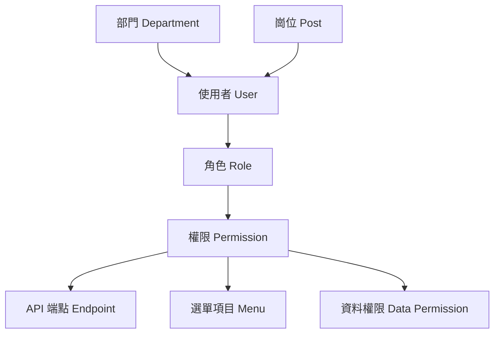

# Go-Admin 權限系統說明

Go-Admin 採用基於 RBAC（角色存取控制）的權限管理系統，結合 Casbin 實作靈活且強大的權限控制機制。

## 權限系統架構

### 核心概念



### 權限層級

1. **功能權限**: 控制使用者能存取哪些功能模組
2. **操作權限**: 控制使用者能執行哪些操作（增刪改查）
3. **資料權限**: 控制使用者能存取哪些資料範圍
4. **欄位權限**: 控制使用者能看到哪些資料欄位

## 資料模型設計

### 使用者模型

```go
// app/admin/models/sys_user.go
type SysUser struct {
    models.Model
    Username    string    `json:"username" gorm:"size:64;not null;unique;comment:使用者名稱"`
    Password    string    `json:"-" gorm:"size:128;not null;comment:密碼"`
    NickName    string    `json:"nickName" gorm:"size:128;comment:暱稱"`
    Phone       string    `json:"phone" gorm:"size:11;comment:手機號碼"`
    RoleId      int       `json:"roleId" gorm:"not null;comment:角色ID"`
    Avatar      string    `json:"avatar" gorm:"size:255;comment:頭像"`
    Sex         string    `json:"sex" gorm:"size:255;comment:性別"`
    Email       string    `json:"email" gorm:"size:128;comment:信箱"`
    DeptId      int       `json:"deptId" gorm:"comment:部門ID"`
    PostId      int       `json:"postId" gorm:"comment:崗位ID"`
    Remark      string    `json:"remark" gorm:"size:255;comment:備註"`
    Status      string    `json:"status" gorm:"size:4;default:2;comment:狀態"`

    // 關聯模型
    Role        *SysRole  `json:"role,omitempty" gorm:"foreignKey:RoleId"`
    Dept        *SysDept  `json:"dept,omitempty" gorm:"foreignKey:DeptId"`
    Post        *SysPost  `json:"post,omitempty" gorm:"foreignKey:PostId"`

    models.ModelTime
    models.ControlBy
}
```

### 角色模型

```go
// app/admin/models/sys_role.go
type SysRole struct {
    models.Model
    RoleName    string     `json:"roleName" gorm:"size:128;not null;comment:角色名稱"`
    Status      string     `json:"status" gorm:"size:4;comment:狀態"`
    RoleKey     string     `json:"roleKey" gorm:"size:128;not null;comment:角色代碼"`
    RoleSort    int        `json:"roleSort" gorm:"comment:角色排序"`
    Flag        string     `json:"flag" gorm:"size:128;comment:標記"`
    Remark      string     `json:"remark" gorm:"size:255;comment:備註"`
    Admin       bool       `json:"admin" gorm:"comment:是否管理員"`
    DataScope   string     `json:"dataScope" gorm:"size:128;comment:資料權限範圍"`

    // 關聯權限
    SysMenu     []SysMenu  `json:"sysMenu,omitempty" gorm:"many2many:sys_role_menu"`
    SysApi      []SysApi   `json:"sysApi,omitempty" gorm:"many2many:sys_role_api"`
    MenuIds     []int      `json:"menuIds,omitempty" gorm:"-"`
    DeptIds     []int      `json:"deptIds,omitempty" gorm:"-"`

    models.ModelTime
    models.ControlBy
}
```

### 權限模型

```go
// app/admin/models/sys_api.go
type SysApi struct {
    models.Model
    Handle      string `json:"handle" gorm:"size:128;not null;comment:控制器"`
    Title       string `json:"title" gorm:"size:128;not null;comment:API標題"`
    Type        string `json:"type" gorm:"size:16;comment:API類型"`
    Action      string `json:"action" gorm:"size:16;comment:請求方法"`
    Path        string `json:"path" gorm:"size:128;not null;comment:API路徑"`

    models.ModelTime
    models.ControlBy
}

// app/admin/models/sys_menu.go
type SysMenu struct {
    models.Model
    MenuName   string     `json:"menuName" gorm:"size:128;not null;comment:選單名稱"`
    Title      string     `json:"title" gorm:"size:128;comment:顯示名稱"`
    Icon       string     `json:"icon" gorm:"size:128;comment:圖示"`
    Path       string     `json:"path" gorm:"size:128;comment:路由路徑"`
    Paths      string     `json:"paths" gorm:"size:128;comment:路徑層級"`
    MenuType   string     `json:"menuType" gorm:"size:1;comment:選單類型"`
    Action     string     `json:"action" gorm:"size:16;comment:操作類型"`
    Permission string     `json:"permission" gorm:"size:255;comment:權限標識"`
    ParentId   int        `json:"parentId" gorm:"comment:父選單ID"`
    NoCache    bool       `json:"noCache" gorm:"comment:是否快取"`
    Breadcrumb string     `json:"breadcrumb" gorm:"size:255;comment:麵包屑"`
    Component  string     `json:"component" gorm:"size:255;comment:元件"`
    Sort       int        `json:"sort" gorm:"comment:排序"`
    Visible    string     `json:"visible" gorm:"size:1;comment:是否顯示"`
    IsFrame    string     `json:"isFrame" gorm:"size:1;default:0;comment:是否外鏈"`

    // 子選單
    Children   []SysMenu  `json:"children,omitempty" gorm:"-"`

    models.ModelTime
    models.ControlBy
}
```

### 部門模型

```go
// app/admin/models/sys_dept.go
type SysDept struct {
    models.Model
    ParentId  int       `json:"parentId" gorm:"comment:父部門ID"`
    DeptPath  string    `json:"deptPath" gorm:"size:255;comment:部門路徑"`
    DeptName  string    `json:"deptName" gorm:"size:128;not null;comment:部門名稱"`
    Sort      int       `json:"sort" gorm:"comment:排序"`
    Leader    string    `json:"leader" gorm:"size:128;comment:負責人"`
    Phone     string    `json:"phone" gorm:"size:11;comment:聯絡電話"`
    Email     string    `json:"email" gorm:"size:64;comment:信箱"`
    Status    string    `json:"status" gorm:"size:4;comment:狀態"`

    // 子部門
    Children  []SysDept `json:"children,omitempty" gorm:"-"`

    models.ModelTime
    models.ControlBy
}
```

## Casbin 整合

### 權限模型配置

```ini
# config/rbac_model.conf
[request_definition]
r = sub, obj, act

[policy_definition]
p = sub, obj, act

[role_definition]
g = _, _

[policy_effect]
e = some(where (p.eft == allow))

[matchers]
m = g(r.sub, p.sub) && r.obj == p.obj && r.act == p.act
```

### 權限策略範例

```go
// 權限策略格式: 主體, 資源, 操作
// p, role:admin, /api/v1/users, GET
// p, role:admin, /api/v1/users, POST
// p, role:admin, /api/v1/users, PUT
// p, role:admin, /api/v1/users, DELETE

// 角色繼承
// g, user:1, role:admin
// g, user:2, role:editor
```

### Casbin 初始化

```go
// common/middleware/auth.go
package middleware

import (
    "github.com/casbin/casbin/v2"
    "github.com/casbin/casbin/v2/model"
    gormadapter "github.com/casbin/gorm-adapter/v3"

    "go-admin/common/database"
    "go-admin/common/log"
)

var Enforcer *casbin.Enforcer

// InitCasbin 初始化 Casbin
func InitCasbin() error {
    // 載入模型
    m, err := model.NewModelFromString(`
        [request_definition]
        r = sub, obj, act

        [policy_definition]
        p = sub, obj, act

        [role_definition]
        g = _, _

        [policy_effect]
        e = some(where (p.eft == allow))

        [matchers]
        m = g(r.sub, p.sub) && r.obj == p.obj && r.act == p.act
    `)
    if err != nil {
        return err
    }

    // 建立適配器
    adapter, err := gormadapter.NewAdapterByDB(database.Orm)
    if err != nil {
        return err
    }

    // 建立執行器
    Enforcer, err = casbin.NewEnforcer(m, adapter)
    if err != nil {
        return err
    }

    // 載入策略
    err = Enforcer.LoadPolicy()
    if err != nil {
        return err
    }

    log.Info("Casbin 初始化成功")
    return nil
}

// CheckPermission 檢查權限
func CheckPermission(userRole, resource, action string) bool {
    result, err := Enforcer.Enforce(userRole, resource, action)
    if err != nil {
        log.Errorf("權限檢查失敗: %v", err)
        return false
    }
    return result
}
```

## 權限中間件

### JWT 認證中間件

```go
// common/middleware/auth.go
func Auth() gin.HandlerFunc {
    return gin.HandlerFunc(func(c *gin.Context) {
        // 從 Header 取得 Token
        token := c.GetHeader("Authorization")
        if token == "" {
            c.JSON(401, gin.H{
                "code":    401,
                "message": "請先登入",
            })
            c.Abort()
            return
        }

        // 驗證 Token
        if strings.HasPrefix(token, "Bearer ") {
            token = token[7:]
        }

        claims, err := jwt.ParseToken(token)
        if err != nil {
            c.JSON(401, gin.H{
                "code":    401,
                "message": "Token 無效",
            })
            c.Abort()
            return
        }

        // 設定使用者資訊到上下文
        c.Set("userId", claims.UserId)
        c.Set("username", claims.Username)
        c.Set("roleId", claims.RoleId)
        c.Set("roleKey", claims.RoleKey)

        c.Next()
    })
}
```

### 權限檢查中間件

```go
// common/middleware/permission.go
func AuthCheckRole() gin.HandlerFunc {
    return gin.HandlerFunc(func(c *gin.Context) {
        // 取得使用者角色
        roleKey, exists := c.Get("roleKey")
        if !exists {
            c.JSON(403, gin.H{
                "code":    403,
                "message": "使用者角色資訊錯誤",
            })
            c.Abort()
            return
        }

        // 取得請求資源和方法
        resource := c.Request.URL.Path
        action := c.Request.Method

        // 檢查權限
        if !CheckPermission(roleKey.(string), resource, action) {
            c.JSON(403, gin.H{
                "code":    403,
                "message": "權限不足",
            })
            c.Abort()
            return
        }

        c.Next()
    })
}
```

### 資料權限中間件

```go
// common/middleware/data_permission.go
func DataPermission() gin.HandlerFunc {
    return gin.HandlerFunc(func(c *gin.Context) {
        userId, _ := c.Get("userId")
        roleKey, _ := c.Get("roleKey")

        // 建立資料權限物件
        permission := &actions.DataPermission{
            UserId:   userId.(int),
            RoleKey:  roleKey.(string),
            DeptId:   getUserDeptId(userId.(int)),
        }

        // 設定到上下文
        c.Set("permission", permission)
        c.Next()
    })
}
```

## 資料權限控制

### 資料權限類型

```go
// common/actions/permission.go
const (
    DataScopeAll         = "1" // 全部資料權限
    DataScopeCustom      = "2" // 自訂資料權限
    DataScopeDept        = "3" // 部門資料權限
    DataScopeDeptAndSub  = "4" // 部門及以下資料權限
    DataScopeSelf        = "5" // 僅本人資料權限
)

type DataPermission struct {
    UserId    int
    RoleKey   string
    DeptId    int
    DataScope string
    DeptIds   []int
}

// Permission 資料權限查詢範圍
func Permission(tableName string, p *DataPermission) func(db *gorm.DB) *gorm.DB {
    return func(db *gorm.DB) *gorm.DB {
        if p == nil {
            return db
        }

        switch p.DataScope {
        case DataScopeAll:
            // 全部資料權限，不加限制
            return db

        case DataScopeCustom:
            // 自訂資料權限
            if len(p.DeptIds) > 0 {
                return db.Where(fmt.Sprintf("%s.create_by IN (SELECT user_id FROM sys_user WHERE dept_id IN ?)", tableName), p.DeptIds)
            }
            return db.Where("1=0") // 沒有指定部門則無權限

        case DataScopeDept:
            // 部門資料權限
            return db.Where(fmt.Sprintf("%s.create_by IN (SELECT user_id FROM sys_user WHERE dept_id = ?)", tableName), p.DeptId)

        case DataScopeDeptAndSub:
            // 部門及子部門資料權限
            deptIds := getSubDeptIds(p.DeptId)
            deptIds = append(deptIds, p.DeptId)
            return db.Where(fmt.Sprintf("%s.create_by IN (SELECT user_id FROM sys_user WHERE dept_id IN ?)", tableName), deptIds)

        case DataScopeSelf:
            // 僅本人資料權限
            return db.Where(fmt.Sprintf("%s.create_by = ?", tableName), p.UserId)

        default:
            return db.Where("1=0") // 預設無權限
        }
    }
}
```

### 在 Service 中使用資料權限

```go
// app/admin/service/sys_user.go
func (e *SysUser) GetPage(c *dto.SysUserGetPageReq, p *actions.DataPermission, list *[]models.SysUser, count *int64) error {
    var data models.SysUser

    err := e.Orm.Model(&data).
        Scopes(
            cDto.MakeCondition(c.GetNeedSearch()),
            cDto.Paginate(c.GetPageSize(), c.GetPageIndex()),
            // 應用資料權限
            actions.Permission(data.TableName(), p),
        ).
        Find(list).Limit(-1).Offset(-1).
        Count(count).Error
    return err
}
```

## 權限管理 API

### 角色權限管理

```go
// app/admin/apis/sys_role.go
// UpdateRoleMenu 更新角色選單權限
func (e SysRole) UpdateRoleMenu(c *gin.Context) {
    req := dto.RoleMenuReq{}
    s := service.SysRole{}
    err := e.MakeContext(c).
        MakeOrm().
        Bind(&req).
        MakeService(&s.Service).
        Errors
    if err != nil {
        e.Logger.Error(err)
        e.Error(500, err, err.Error())
        return
    }

    err = s.UpdateRoleMenu(&req)
    if err != nil {
        e.Error(500, err, fmt.Sprintf("更新角色選單權限失敗，%s", err.Error()))
        return
    }

    // 更新 Casbin 策略
    go updateCasbinPolicy(req.RoleId)

    e.OK(nil, "更新成功")
}

// UpdateRoleApi 更新角色 API 權限
func (e SysRole) UpdateRoleApi(c *gin.Context) {
    req := dto.RoleApiReq{}
    s := service.SysRole{}
    err := e.MakeContext(c).
        MakeOrm().
        Bind(&req).
        MakeService(&s.Service).
        Errors
    if err != nil {
        e.Logger.Error(err)
        e.Error(500, err, err.Error())
        return
    }

    err = s.UpdateRoleApi(&req)
    if err != nil {
        e.Error(500, err, fmt.Sprintf("更新角色API權限失敗，%s", err.Error()))
        return
    }

    // 更新 Casbin 策略
    go updateCasbinPolicy(req.RoleId)

    e.OK(nil, "更新成功")
}
```

### 動態權限更新

```go
// common/service/casbin.go
func updateCasbinPolicy(roleId int) {
    // 清除舊策略
    _, err := Enforcer.RemoveFilteredPolicy(0, fmt.Sprintf("role:%d", roleId))
    if err != nil {
        log.Errorf("清除角色權限策略失敗: %v", err)
        return
    }

    // 載入新策略
    var roleApis []models.SysRoleApi
    database.Orm.Where("role_id = ?", roleId).Find(&roleApis)

    for _, ra := range roleApis {
        var api models.SysApi
        database.Orm.First(&api, ra.SysApiId)

        // 添加新策略
        _, err := Enforcer.AddPolicy(fmt.Sprintf("role:%d", roleId), api.Path, api.Action)
        if err != nil {
            log.Errorf("添加權限策略失敗: %v", err)
        }
    }

    // 儲存策略
    err = Enforcer.SavePolicy()
    if err != nil {
        log.Errorf("儲存權限策略失敗: %v", err)
    }
}
```

## 前端權限整合

### 權限指令

```javascript
// src/directive/permission.js
import store from "@/store";

// 權限指令
export default {
	inserted(el, binding) {
		const { value } = binding;
		const roles = store.getters && store.getters.roles;
		const permissions = store.getters && store.getters.permissions;

		if (value && value instanceof Array && value.length > 0) {
			const permissionRoles = value;

			const hasPermission = roles.some((role) => {
				return permissionRoles.includes(role);
			});

			const hasPermissionCode = permissions.some((permission) => {
				return permissionRoles.includes(permission);
			});

			if (!hasPermission && !hasPermissionCode) {
				el.parentNode && el.parentNode.removeChild(el);
			}
		} else {
			throw new Error(`使用方式: v-permission="['admin','editor']"`);
		}
	},
};
```

### 路由守衛

```javascript
// src/router/permission.js
import router from "./routers";
import store from "@/store";
import { Message } from "element-ui";
import NProgress from "nprogress";
import { getToken } from "@/utils/auth";

const whiteList = ["/login", "/register"]; // 白名單

router.beforeEach(async (to, from, next) => {
	NProgress.start();

	const hasToken = getToken();

	if (hasToken) {
		if (to.path === "/login") {
			next({ path: "/" });
			NProgress.done();
		} else {
			const hasRoles = store.getters.roles && store.getters.roles.length > 0;
			if (hasRoles) {
				next();
			} else {
				try {
					// 取得使用者資訊和權限
					const { roles, permissions } = await store.dispatch("user/getInfo");

					// 根據權限生成路由
					const accessRoutes = await store.dispatch("permission/generateRoutes", { roles, permissions });

					// 動態添加路由
					router.addRoutes(accessRoutes);

					next({ ...to, replace: true });
				} catch (error) {
					await store.dispatch("user/resetToken");
					Message.error(error || "系統錯誤");
					next(`/login?redirect=${to.path}`);
					NProgress.done();
				}
			}
		}
	} else {
		if (whiteList.indexOf(to.path) !== -1) {
			next();
		} else {
			next(`/login?redirect=${to.path}`);
			NProgress.done();
		}
	}
});
```

### 選單權限過濾

```javascript
// src/store/modules/permission.js
import { constantRoutes } from "@/router";
import { getRouters } from "@/api/menu";

function filterAsyncRoutes(routes, roles, permissions) {
	const res = [];

	routes.forEach((route) => {
		const tmp = { ...route };
		if (hasPermission(roles, permissions, tmp)) {
			if (tmp.children) {
				tmp.children = filterAsyncRoutes(tmp.children, roles, permissions);
			}
			res.push(tmp);
		}
	});

	return res;
}

function hasPermission(roles, permissions, route) {
	if (route.meta && route.meta.roles) {
		return roles.some((role) => route.meta.roles.includes(role));
	} else if (route.meta && route.meta.permissions) {
		return permissions.some((permission) => route.meta.permissions.includes(permission));
	} else {
		return true;
	}
}

const state = {
	routes: [],
	addRoutes: [],
};

const mutations = {
	SET_ROUTES: (state, routes) => {
		state.addRoutes = routes;
		state.routes = constantRoutes.concat(routes);
	},
};

const actions = {
	generateRoutes({ commit }, { roles, permissions }) {
		return new Promise((resolve) => {
			getRouters().then((response) => {
				const { data } = response;
				const accessedRoutes = filterAsyncRoutes(data, roles, permissions);
				commit("SET_ROUTES", accessedRoutes);
				resolve(accessedRoutes);
			});
		});
	},
};

export default {
	namespaced: true,
	state,
	mutations,
	actions,
};
```

## 權限測試

### 單元測試

```go
// common/middleware/auth_test.go
package middleware

import (
    "testing"
    "github.com/stretchr/testify/assert"
)

func TestCheckPermission(t *testing.T) {
    // 初始化 Casbin
    err := InitCasbin()
    assert.NoError(t, err)

    // 添加測試策略
    Enforcer.AddPolicy("role:admin", "/api/v1/users", "GET")
    Enforcer.AddPolicy("role:admin", "/api/v1/users", "POST")

    // 測試權限檢查
    testCases := []struct {
        role     string
        resource string
        action   string
        expected bool
    }{
        {"role:admin", "/api/v1/users", "GET", true},
        {"role:admin", "/api/v1/users", "POST", true},
        {"role:admin", "/api/v1/users", "DELETE", false},
        {"role:user", "/api/v1/users", "GET", false},
    }

    for _, tc := range testCases {
        result := CheckPermission(tc.role, tc.resource, tc.action)
        assert.Equal(t, tc.expected, result)
    }
}
```

### 整合測試

```bash
#!/bin/bash
# permission_test.sh - 權限整合測試

BASE_URL="http://localhost:8000/api/v1"

# 測試管理員權限
ADMIN_TOKEN="admin_jwt_token"

echo "測試管理員權限..."
curl -X GET "$BASE_URL/users" \
  -H "Authorization: Bearer $ADMIN_TOKEN" \
  -w "Status: %{http_code}\n"

# 測試一般使用者權限
USER_TOKEN="user_jwt_token"

echo "測試一般使用者權限..."
curl -X GET "$BASE_URL/users" \
  -H "Authorization: Bearer $USER_TOKEN" \
  -w "Status: %{http_code}\n"

# 測試無權限操作
echo "測試無權限操作..."
curl -X DELETE "$BASE_URL/users/1" \
  -H "Authorization: Bearer $USER_TOKEN" \
  -w "Status: %{http_code}\n"
```

## 權限最佳實踐

### 1. 安全性原則

- **最小權限原則**: 賦予使用者完成工作所需的最小權限
- **權限分離**: 避免單一使用者擁有過多關鍵權限
- **定期審核**: 定期檢查和清理不必要的權限
- **權限繼承**: 合理設計角色層級關係

### 2. 效能最佳化

```go
// 權限快取
type PermissionCache struct {
    cache map[string]bool
    mutex sync.RWMutex
    ttl   time.Duration
}

func (pc *PermissionCache) CheckPermission(key string) (bool, bool) {
    pc.mutex.RLock()
    defer pc.mutex.RUnlock()

    result, exists := pc.cache[key]
    return result, exists
}

func (pc *PermissionCache) SetPermission(key string, result bool) {
    pc.mutex.Lock()
    defer pc.mutex.Unlock()

    pc.cache[key] = result

    // 設定過期時間
    time.AfterFunc(pc.ttl, func() {
        pc.mutex.Lock()
        delete(pc.cache, key)
        pc.mutex.Unlock()
    })
}
```

### 3. 審計日誌

```go
// 權限操作審計
func logPermissionChange(userId int, operation string, resource string, details string) {
    log := models.SysOperLog{
        Title:        "權限變更",
        BusinessType: "權限管理",
        Method:       operation,
        RequestUrl:   resource,
        OperUserId:   userId,
        OperUserName: getUserName(userId),
        OperTime:     time.Now(),
        JsonResult:   details,
    }

    database.Orm.Create(&log)
}
```

### 4. 權限異常處理

```go
// 權限異常恢復機制
func recoverPermission(userId int) error {
    // 檢查使用者是否被誤刪權限
    var user models.SysUser
    err := database.Orm.First(&user, userId).Error
    if err != nil {
        return err
    }

    // 恢復基本權限
    if user.RoleId == 0 {
        // 賦予預設角色
        user.RoleId = getDefaultRoleId()
        database.Orm.Save(&user)
    }

    return nil
}
```

---

Go-Admin 的權限系統提供了全面且靈活的安全控制機制，確保系統資源的安全存取。

相關文件：

- [API 開發指南](./api-guide.md)
- [模組建立教學](./module-creation.md)
- [資料庫設計文檔](./database-design.md)
- [安全指南](../security/security-guide.md)
